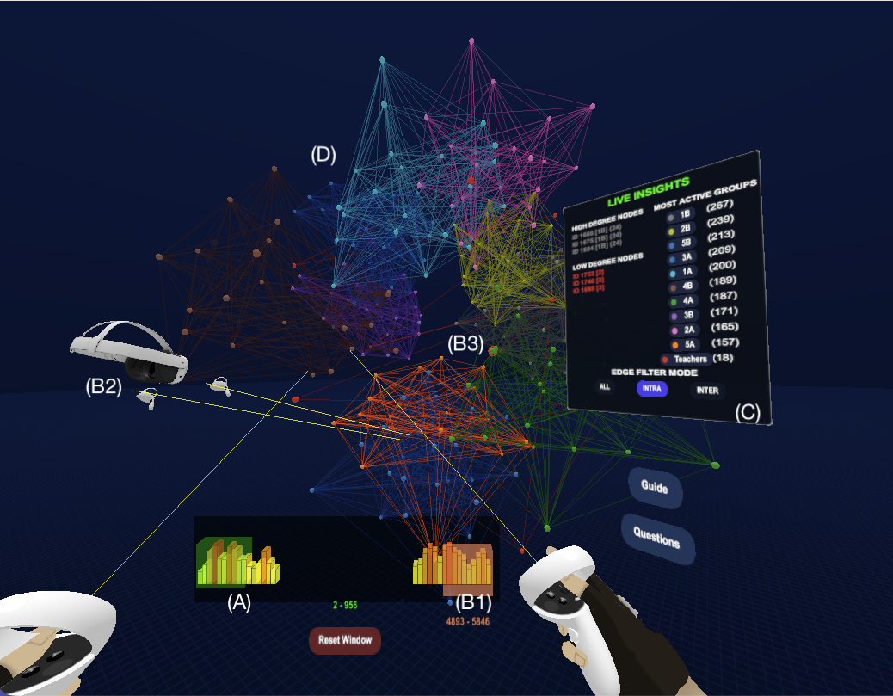

# TempoNetVR

## Interactive Temporal Windowing in Virtual Reality

TempoNetVR is an immersive WebXR-based visualization system for exploring temporal graph data in virtual reality. The system allows users to directly manipulate a temporal window in 3D space, enabling continuous exploration of evolving graph structures without relying on predefined time slices.


---

## Overview

Traditional temporal graph visualization techniques often rely on animations, sliders, or fixed time slices. These approaches can make it difficult to investigate arbitrary temporal intervals and identify patterns in datasets with uneven activity distributions.

TempoNetVR addresses this challenge by representing time as a directly manipulable dimension. Users can adjust a temporal window to dynamically filter graph data while receiving immediate visual feedback through an embedded histogram and real-time graph updates.

The system supports both individual and collaborative exploration within a shared virtual environment.

---

## Main Interface



---

## Features

### Interactive Temporal Windowing

- Direct manipulation of temporal intervals
- Continuous temporal filtering
- Real-time graph updates
- Exploration of arbitrary time ranges

### Embedded Histogram Visualization

- Overview of temporal activity across the dataset
- Feedforward interaction support
- Identification of high-activity periods before filtering

### Graph Exploration

- 3D force-directed graph layout
- Node selection and inspection
- Neighborhood highlighting
- Group-based filtering
- Intra-group and inter-group analysis modes

### Live Insights Panel

Displays contextual information for the currently selected temporal interval:

- Most active nodes
- Group activity summaries
- Interaction statistics
- Temporal activity rankings

### Collaborative Analysis

- Multi-user VR sessions
- Shared temporal context
- Avatar representation
- Synchronized interaction cues
- Real-time voice communication

---

## Technology Stack

### Frontend

- JavaScript (ES Modules)
- Vite
- Three.js
- WebXR

### Visualization

- 3d-force-graph
- d3-force
- d3-scale
- d3-scale-chromatic
- Chart.js

### Collaboration

- Socket.IO
- Real-time avatar synchronization
- Spatial voice communication

### Hardware

- Meta Quest 2
- WebXR-compatible browsers

---

## Datasets

TempoNetVR includes two publicly available temporal graph datasets commonly used in network analysis research.

### Hospital Ward Dynamic Contact Network

This dataset captures face-to-face interactions between patients and healthcare workers in a hospital ward using wearable proximity sensors.

**Source:**

Vanhems, P., Barrat, A., Cattuto, C., Pinton, J.-F., Khanafer, N., Régis, C., Kim, B.-H., Comte, B., & Voirin, N. (2013). *Estimating potential infection transmission routes in hospital wards using wearable proximity sensors*. PLoS ONE, 8(9), e73970.

### Primary School Temporal Network

This dataset captures high-resolution face-to-face interactions between students and teachers in a primary school environment.

**Sources:**

Stehlé, J., Voirin, N., Barrat, A., Cattuto, C., Isella, L., Pinton, J.-F., Quaggiotto, M., Van den Broeck, W., Régis, C., Lina, B., & Vanhems, P. (2011). *High-resolution measurements of face-to-face contact patterns in a primary school*. PLoS ONE, 6(8), e23176.

Gemmetto, V., Barrat, A., & Cattuto, C. (2014). *Mitigation of infectious disease at school: targeted class closure vs school closure*. BMC Infectious Diseases, 14, 695.

> **Note:** The datasets are not original contributions of this project. Credit belongs to the original authors listed above.

---

## Installation

### Clone Repository

```bash
git clone https://github.com/Danial-Gholamian/webxr4.git
cd webxr4
```

### Install Dependencies

```bash
npm install
```

### Run Development Server

```bash
npm run dev
```

### Build Production Version

```bash
npm run build
```

### Preview Production Build

```bash
npm run preview
```

---

## Controls

### VR Interaction

- Trigger: Select nodes and UI elements
- Ray Pointer: Graph interaction
- Controller Movement: Manipulate temporal window
- Navigation: Explore graph from different viewpoints

### Graph Interaction

- Select nodes
- Highlight neighbors
- Filter by group
- Switch between:
  - All edges
  - Intra-group edges
  - Inter-group edges

---

## Project Structure

```text
TempoNetVR
│
├── WebXR / Three.js Rendering
├── Temporal Window Controller
├── Histogram Visualization
├── Graph Visualization Layer
├── Insight System
├── Collaboration Layer (Socket.IO)
├── Voice Communication
└── Dataset Adapters
```

### Main Modules

| File | Responsibility |
|------|---------------|
| `main.js` | Application entry point |
| `graphVisualController.js` | Graph filtering and visualization logic |
| `histogram.js` | Temporal histogram and window interaction |
| `insightPanel.js` | Live analytics dashboard |
| `insightSystem.js` | Insight calculations |
| `network.js` | Multi-user synchronization |
| `voice.js` | Voice communication |
| `vrSetup.js` | VR interaction handling |
| `dataset.js` | Dataset management |

---

## Build & Deploy

### Build

```bash
npm run build
```

This will generate a production-ready build in the `dist/` directory.

### GitHub Pages

If GitHub Pages is configured to serve from the `docs/` folder:

```bash
cp -r dist docs
git add docs -f
git commit -m "Deploy build to GitHub Pages"
git push
```

Then configure:

```text
Settings → Pages
Branch: main
Folder: /docs
```

---
